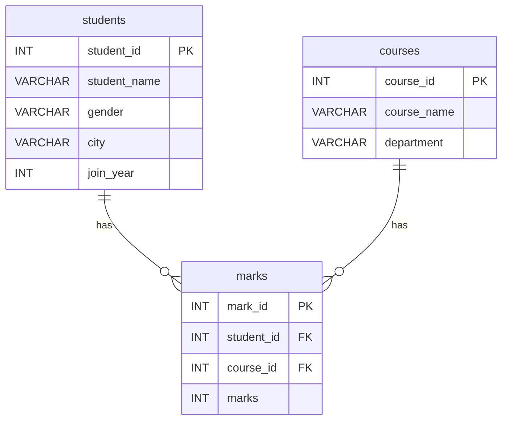

# Day 15 – Data Analytics Daily Challenge

### College Student Management System (SQL)

A beginner-friendly SQL challenge where you play the role of a **Data Analyst** analyzing a college database of students, courses, and marks. The challenge covers filtering, sorting, and basic aggregate functions across 18 questions in 4 levels.

---

## 📁 Repository Contents

| File | Description |
|------|-------------|
| `Day15_Coding_Challenge.pdf` | Problem statement, table structure, sample data, and the 18 questions |
| `day_15_data_analytics_daily_challenge.sql` | Table creation, data inserts, and my solutions to all questions |

---

## 🗄️ Database Schema



### Sample Data

**students**

| student_id | student_name | gender | city | join_year |
|---|---|---|---|---|
| 1 | Anu | F | Tumakuru | 2024 |
| 2 | Ravi | M | Bengaluru | 2023 |
| 3 | Kiran | M | Tumakuru | 2024 |
| 4 | Sneha | F | Mysuru | 2023 |
| 5 | Manu | M | Tumakuru | 2022 |

**courses**

| course_id | course_name | department |
|---|---|---|
| 101 | SQL Basics | Computer Science |
| 102 | Excel for Analysts | Commerce |
| 103 | Statistics | Mathematics |

**marks**

| mark_id | student_id | course_id | marks |
|---|---|---|---|
| 1 | 1 | 101 | 85 |
| 2 | 2 | 101 | 72 |
| 3 | 3 | 101 | 90 |
| 4 | 4 | 102 | 88 |
| 5 | 5 | 103 | 67 |
| 6 | 1 | 103 | 79 |
| 7 | 2 | 102 | 81 |

---

## 🎯 Challenge Questions

### Level 1: Very Basic
1. Display all students
2. Display only `student_name` and `city`
3. Show all courses
4. Display students from Tumakuru
5. Display students who joined in 2024

### Level 2: Filtering
6. Show students whose gender is F
7. Show marks greater than 80
8. Display course names from the Commerce department
9. Show students who are not from Bengaluru
10. Display marks between 70 and 90

### Level 3: Sorting
11. Display all students ordered by `student_name` ascending
12. Show marks ordered from highest to lowest
13. Display students ordered by `join_year` descending

### Level 4: Aggregate Basics
14. Find total number of students
15. Find average marks
16. Find highest marks
17. Find lowest marks
18. Find total marks scored by all students

---

## 🧠 SQL Concepts Covered

- `SELECT` and column selection
- `WHERE` filtering (`=`, `<>`, `>`, `BETWEEN`)
- `ORDER BY` (`ASC` / `DESC`)
- Aggregate functions: `COUNT`, `SUM`, `AVG`, `MAX`, `MIN`
- `JOIN` between tables
- `GROUP BY`

---

## 🚀 How to Run

1. Install **MySQL** (and optionally MySQL Workbench).
2. Create the database used in the script:
   ```sql
   CREATE DATABASE dailychallenge;
   ```
3. Open `day_15_data_analytics_daily_challenge.sql` in MySQL Workbench (or run it from the command line):
   ```bash
   mysql -u your_username -p < day_15_data_analytics_daily_challenge.sql
   ```
4. Run the queries one by one and check the output.

---

## 🛠️ Tech Stack

- **Language:** SQL
- **Database:** MySQL

---

## 📌 About

This repo is part of my **Data Analytics Daily Challenge** series, where I practice a new set of problems every day to build strong fundamentals in SQL and data analysis.

⭐ Feel free to star the repo if you find it useful!
